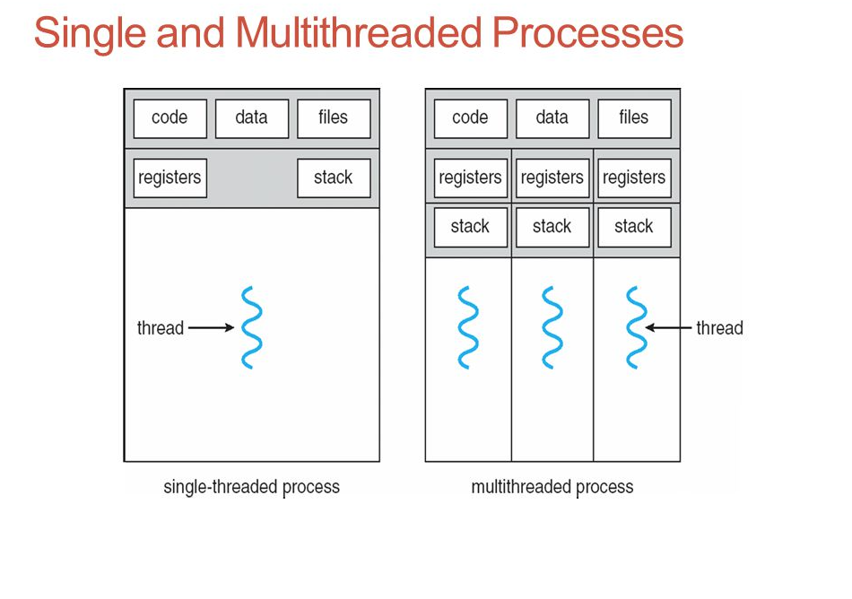

# Basic Thread

## Overview

This project was carried out to better understand the steps needed to develop threads using C within a given process.
Processes and threads can be thought of as the execution units of any operating system. A process can be thought
of as a running instance of a program, that is the time at which a binary executable is executed. Leading on from that,
a thread can be thought of as a unit of execution within a process - It is a possible flow of execution of the main process.
A given process has at least one thread (the main thread), ensuring that all threads run concurrently in a multithreaded process.

Threads are an efficient way to improve the performance of an application through parallelism. For example, in a browser, multiple
tabs can be different threads. Or, MS word uses multiple threads, one thread to format the text, other thread to process inputs, etc.

The main implementation in C was done utilizing the **[POSIX threads/pthreads](https://en.wikipedia.org/wiki/POSIX_Threads)** standard, the **[pthread_create()](https://linux.die.net/man/3/pthread_create)** function and the
**[pthread_join()](https://linux.die.net/man/3/pthread_join)** function.

## Structure

## Prerequisites

## Usage

## License

Distributed under the MIT license - Please see the **LICENSE** file for more information.

## Acknowledgements

- C++ System Programming Cookbook - Onorato Vaticone
- How Linux Works, 2nd Edition - Brian Ward
- GeekforGeeks - [Thread function in C/C++](https://www.geeksforgeeks.org/thread-functions-in-c-c/)
- Linux Docs - [Pthread Docs](https://www.die.net/)

## Contact

- Name: James Aymer
- Email: [aymerjames@gmail.com](mailto:aymerjames@gmail.com)
- Linkedin: https://uk.linkedin.com/in/jamesaymer
- Github: https://github.com/JaymoAymer
